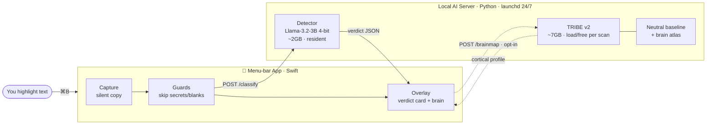

# Cortical Persuasion Decoder — Architecture & Debrief

A plain-English map of how the whole system fits together. For the deep dive (origins,
experiments, and pivots), see the interactive **[field manual](field-manual.html)**; for the
one-page visual, see **[architecture.html](architecture.html)**.

---

## What it is

A Mac app that acts as a **manipulation x-ray**. Highlight any text — a tweet, an article, an
email — press **⌘B**, and it names the persuasion tactic being used on you (fear-mongering,
false urgency, hype, FOMO, …) with a confidence score. Optionally, it renders a small **brain
map** of *where* in your cortex that language lands. Everything runs on-device — no cloud, no API
keys, no telemetry.

## The one big idea

Two AIs, two jobs:

- **Detection = a local language model.** It *names* the tactic. It is the judge.
- **Interpretation = TRIBE v2** (Meta's fMRI model). It *illustrates* where the words land in
  cortex. It is never the detector.

This split isn't cosmetic — it's the result the project's own experiments forced (see below).

## The system, on one diagram

Two OS processes talk over one loopback port (`127.0.0.1:8765`). The app holds no model; the
server holds both and stays warm across sessions.

## The two flows

| Path | Trigger | What happens | Speed |
|---|---|---|---|
| **Detect** | ⌘B (every time) | grab selection → `/classify` → **gate** ("is this manipulation at all?") → if yes, name the tactic → verdict card (else "no manipulation") | ~0.5–0.7s |
| **Deep-scan** | 🧠 menu (opt-in) | `/brainmap` → TRIBE predicts cortex → compare vs neutral → brain systems light up | ~15s–2min |

**Detection is two-stage.** A single 12-way classifier forced *every* input toward its nearest
label, so a friendly greeting became "Hype 84%". Now a clean yes/no **gate** decides "is this
trying to persuade or manipulate?" first — benign text (greetings, requests, facts, reviews) →
*none*; only if it passes does the 12-way technique classifier run. On a realistic mix (60%
benign) this catches **all** manipulation with a ~10% false-positive rate.

## The two models

| | Detector | TRIBE v2 |
|---|---|---|
| **Role** | Judge (always resident) | Illustrator (loaded on demand) |
| **Model** | Llama-3.2-3B Instruct, 4-bit (MLX) | Meta fMRI foundation model |
| **Job** | Names the tactic + real confidence | Predicts *where in cortex* text lands |
| **Size** | ~2 GB, stays loaded | ~7 GB, loaded & freed per scan |
| **Why** | The **better detector** | **Never** a detector — visceral picture only |

**Honesty rule baked into the wiring:** TRIBE only sees the cortex, not deep structures like the
amygdala. So the UI says "engages your value / language-evaluation cortex," never "fires your fear
center." The system is built to never overclaim.

## The journey (why it looks like this)

1. **It started bolder:** use the brain model *as* the detector, and claim "this triggers your
   amygdala," etc.
2. **The project's own experiments demolished that:** different emotions don't light up different
   regions, and the brain model is a *worse* detector than plain text (it can't beat the words it's
   built from — 100% vs 75% in a fair test).
3. **So it pivoted to the honest version:** language model detects, brain map only illustrates. That
   intellectual honesty is the backbone of the whole design.

## Where each piece lives

**App (Swift, `Sources/`)**

| Path | Responsibility |
|---|---|
| `App/AppDelegate` | Orchestrator — menu bar, permissions, ⌘B, the shared guard gate |
| `Capture/PasteboardCapture` | Grabs the selection with a silent copy, restores the clipboard |
| `Capture/RegionCapture` · `OCRService` | Screenshot a region and read its text (deferred path) |
| `Hotkey/HotkeyMonitor` | The non-consuming global ⌘B listener |
| `Classifier/RemoteClassifier` | Talks to the server — the app↔AI seam |
| `Overlay/OverlayController` · `OverlayView` | The floating verdict card + brain glow + timing |
| `Taxonomy/Taxonomy` | Tactic names + plain-English mechanisms (no anatomy) |
| `Support/SensitiveText` | Screens out passwords, keys, card numbers before analysis |

**Server (Python, `server/`)**

| Path | Responsibility |
|---|---|
| `server.py` | FastAPI service — both endpoints, the scoring, the brain pipeline |
| `tribe_events.py` | Feeds text to TRIBE without audio + the anti-deadlock hardening |
| `build_baseline.py` | Builds the "normal brain" reference from 30 neutral sentences |
| `apply_patches.py` | Makes TRIBE run on Apple Silicon; removes the Google-upload leak |
| `experiments/` | The A1–A7 research scripts that proved the whole approach |
| `scripts/launchd/` | The agent that keeps the server alive 24/7 |

## The stack

Swift · SwiftUI · AppKit — Python · FastAPI · uvicorn — MLX 4-bit (Apple GPU) · Llama-3.2-3B —
TRIBE v2 · PyTorch · Metal — Vision OCR · ScreenCaptureKit — launchd · self-signed cert — 100%
on-device.

## Performance & testing

- **Classify is ~0.5–0.7s** (p50): the prompt's KV-cache is reused across label scorings instead
  of re-processing the prompt each time; the two-stage gate adds a second short pass. Cached ~1ms.
- **Realistic benchmark** (`realistic_set.jsonl`, 60% benign — the true usage mix): **20/20
  manipulation caught, 27/30 benign correctly ignored**. Greetings/facts/requests no longer
  misfire. (The older 72-example manipulation-only set reads 75% — it's harder/unrepresentative.)
- **Test suite:** pytest (contract / behavior / benign & realistic false-positive guards /
  taxonomy-drift / robustness), the `run_eval.py` accuracy harness, a latency bench, and Swift
  self-tests for OCR + the secret guard.

## Status

- ✅ **Works:** ⌘B detection (instant feedback), deep-scan brain map, **Capture Region** (needs
  Screen Recording granted), the always-on server, stable permissions, and menu QoL (last verdict /
  recent history / copy / analyze-clipboard).
- 📌 **Honest gaps:** the *algorithm* is validated by experiments **and** now by the eval/benchmark
  suite; the Swift *app UI* still has no automated UI tests (logic is covered by the self-tests).
  Deep-scan latency needs a reboot to re-measure (swap was maxed during the last sprint).
